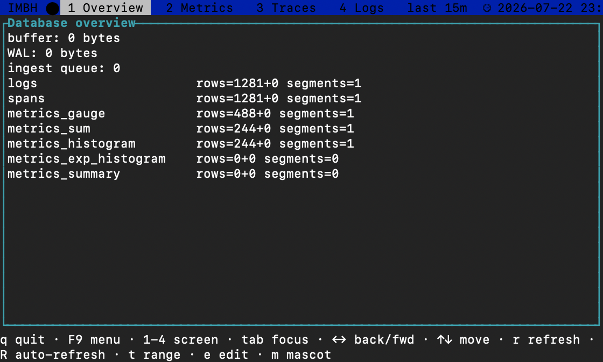
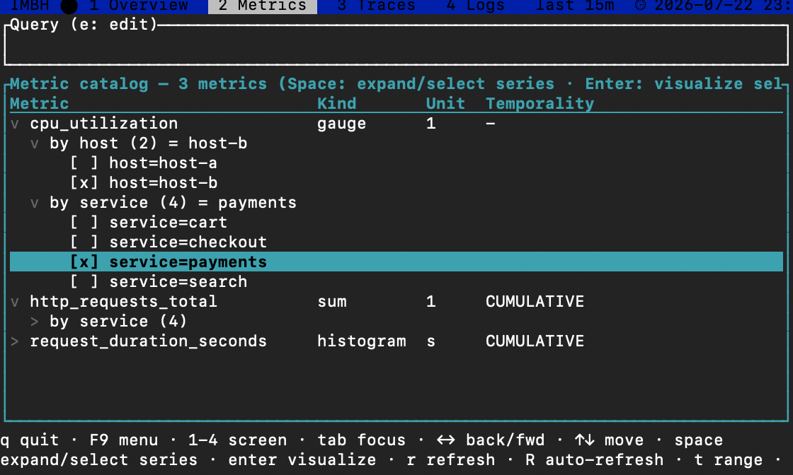
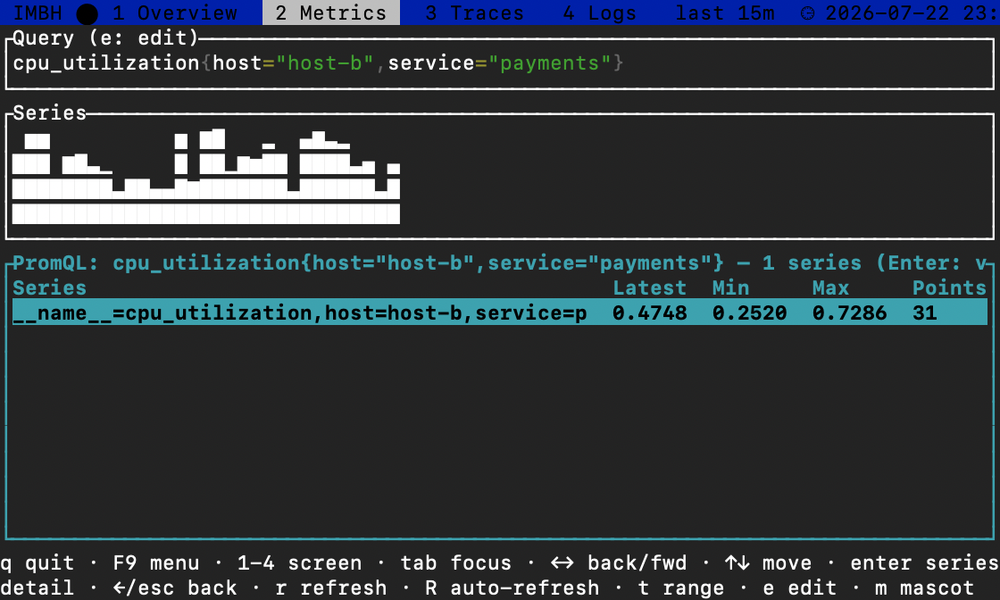
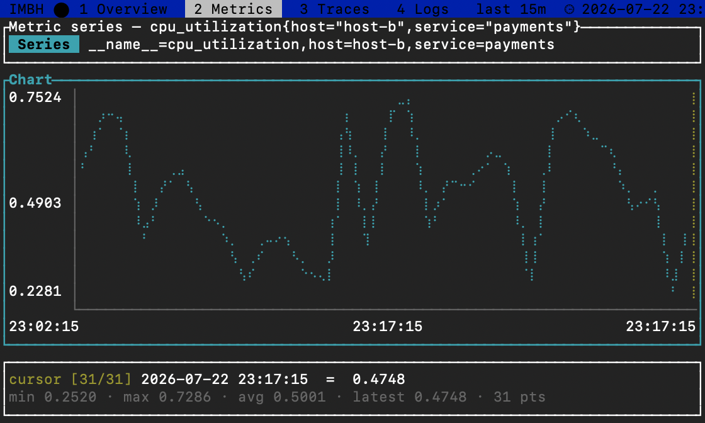
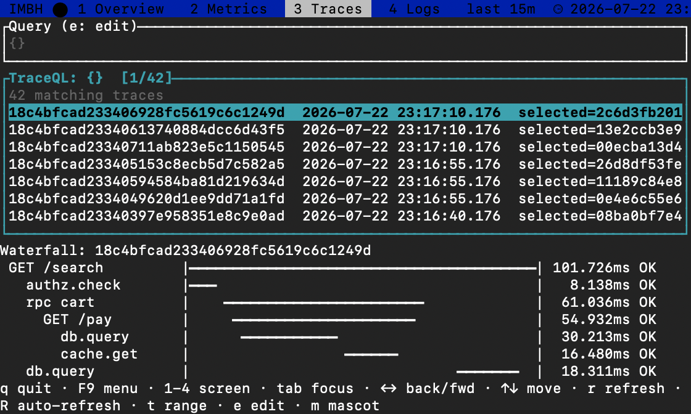
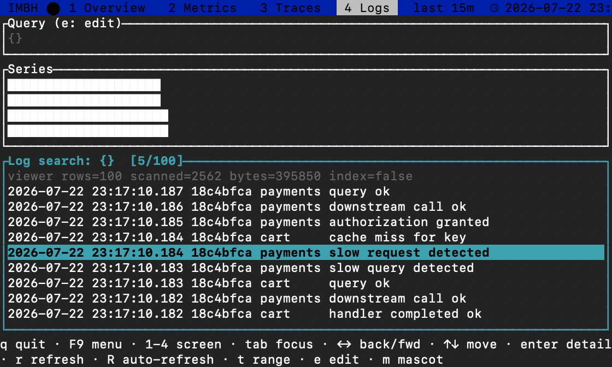
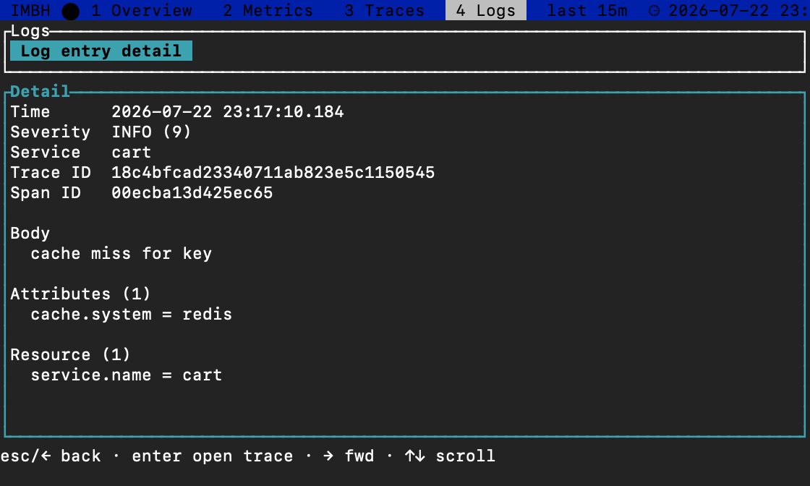

# IMBH


**A small-footprint, embeddable observability database for Rust.**

[](https://github.com/moriyoshi/imbh/actions/workflows/ci.yml)

IMBH ingests OpenTelemetry **logs, traces, and metrics**, stores them durably in a compact
columnar format, and answers queries through [Apache DataFusion](https://datafusion.apache.org/)
(SQL and typed query plans) and [Tantivy](https://github.com/quickwit-oss/tantivy) (full-text and
term search). You link it into your process, feed it OTLP, and query it through typed Rust
APIs, SQL, or bounded **PromQL / LogQL / TraceQL** compatibility profiles — no Loki + Tempo + Mimir,
no `docker run`, no network hop.

> Think "the SQLite of observability" in *embeddability*, not in kilobytes: a real query engine
> has a real cost (the core stack measures ~32 MiB). IMBH is **compact**, not tiny — see
> [Footprint](#footprint).

The product is the **library**. Any HTTP server is wiring the host owns; the reference `imbhd`
binary is one worked example of that wiring, not the deliverable.

## Status

**v0.1.0 is released** — all 12 shipping crates are published on crates.io, so `cargo add imbh`
works. Pre-1.0: the API may still change between minor versions. The core is feature-complete
across all three signals:
durable ingest, per-segment full-text search, typed query APIs, cross-signal SQL, compaction,
a reference server, and an OpenTelemetry SDK exporter are all built and tested (milestones M0–M6).
On top of that core, two adjacent surfaces have landed: bounded **PromQL / LogQL / TraceQL**
compatibility profiles (the `imbh-lgtm` crate) and a read-only **companion TUI** (`imbh-tui`).
See [`.agents/docs/OVERVIEW.md`](./.agents/docs/OVERVIEW.md) §13 for the milestone breakdown.

## Why IMBH

Primary use cases, in priority order:

1. **In-process telemetry buffer/store** for edge agents, CLI tools, and appliances that can't
   ship data to a SaaS (or want a local window before shipping).
2. **Dev-loop observability**: a local backend for looking at your own app's traces/logs/metrics
   while developing, with nothing to stand up.
3. **Small-fleet sidecar**: one binary per host, days of retention, queried ad hoc.

Design constraints: small footprint (dependency graph, binary size, runtime RSS); embeddable
first; DataFusion for query, Tantivy for search; OpenTelemetry semantics throughout.

**Non-goals (v1):** distribution/replication/HA, point deletes/updates (data is immutable;
deletion is retention-only), dashboards/UI beyond
the read-only companion TUI, and multiple concurrent writer processes (a single writer with many
cross-process read-only readers *is* supported — see the
[FAQ](#who-can-open-a-database-at-once-writers-and-readers)).

## How IMBH compares

The open-source observability field has converged on **all-in-one** platforms that unify logs,
traces, and metrics in one product (replacing the separate Loki + Tempo + Mimir components), and
several of these ship as a **single small binary**. IMBH sits in that category but adds one axis
none of the others offer: it is an **embeddable library** you link into your own process — no
server, no daemon, no separate database, no `docker run`.

| Project | Deployment model | Signals | Storage engine | Query surface | Runtime weight | Language | License |
|---------|------------------|---------|----------------|---------------|----------------|----------|---------|
| **IMBH** | **Embeddable library** (in-process); optional reference server + TUI | Logs · Traces · Metrics · **full-text** | Local Parquet segments + per-segment Tantivy index | Typed Rust APIs + **SQL** (DataFusion) + bounded PromQL/LogQL/TraceQL | **~32 MiB binary, ~36 MB RSS**, no separate DB | Rust | Apache-2.0 |
| [OpenObserve](https://github.com/openobserve/openobserve) | Single binary **or** HA cluster | Logs · Traces · Metrics · RUM | Parquet on local disk / object store | SQL, partial PromQL | Runs from ~512 MB RAM | Rust | AGPL-3.0 |
| [GreptimeDB](https://github.com/GreptimeTeam/greptimedb) | Single-binary standalone **or** distributed cluster | Metrics · Logs · Traces | Columnar engine (DataFusion) on object store + tiered cache | SQL + PromQL | Standalone binary; cluster for scale | Rust | Apache-2.0 |
| [Parseable](https://github.com/parseablehq/parseable) | Single binary **or** distributed | Logs (+ OTel signals) | Arrow/Parquet on object store | SQL | Single binary + object store | Rust | AGPL-3.0 |
| [SigNoz](https://github.com/SigNoz/signoz) | Multi-container stack (Compose/K8s) | Logs · Traces · Metrics | **ClickHouse** | ClickHouse SQL + query builder | ClickHouse + collector + UI (multi-GB) | Go / TS | MIT |
| [Uptrace](https://github.com/uptrace/uptrace) | Server + external databases | Logs · Traces · Metrics | **ClickHouse** + PostgreSQL | SQL-like + PromQL | Server + ClickHouse + PostgreSQL | Go | AGPL-3.0 |
| [Grafana LGTM](https://github.com/grafana) (Loki + Tempo + Mimir) | Distributed, per-signal services | Logs · Traces · Metrics | Object store, one store per signal | LogQL / TraceQL / PromQL | Several services + object store | Go | AGPL-3.0 |

**The distinction that matters:** every other row is, at minimum, a standalone server you deploy
and operate; SigNoz and Uptrace additionally require an external ClickHouse (and Postgres), and
the Grafana stack is three separate systems. IMBH is the only one you can `cargo add` and call
in-process — the "SQLite of observability" niche (embeddable, single-node, zero operational
surface). It trades their horizontal scale and mature UIs for that embeddability and a ~32 MiB
footprint. If you need a cluster, petabyte retention, or a turnkey dashboard, one of the servers
above is the better fit; if you need a real logs+traces+metrics store *inside* an edge agent, CLI,
appliance, or dev loop, that is exactly IMBH's lane.

(Facts as of 2026; deployment models and licenses evolve — check each project's repository.)

## How it works

The lifecycle is InfluxDB-IOx-style, immutability everywhere:

```
OTLP → WAL → Arrow mutable buffer → immutable Parquet segments
                                    + per-segment Tantivy index sidecar → manifest
```

- The **WAL** gives durability; replay is idempotent via a per-generation LSN watermark.
- The **mutable buffer** holds per-table rows bounded by bytes; sealing builds an immutable
  Parquet **segment** with a co-located Tantivy index sidecar.
- The **manifest** — written atomically, never a directory scan — is the sole source of truth
  for what is queryable.
- **Queries see the buffer unioned with sealed segments**, so data is queryable immediately on
  ingest, before any flush.
- Full-text hits from Tantivy map to Parquet rows through a row-ordinal bridge, applied only
  when a cost gate says pruning wins.

The full mechanics live in [`.agents/docs/ARCHITECTURE.md`](./.agents/docs/ARCHITECTURE.md).

## Quick start (embed the library)

```rust
use imbh::{Db, LogQuery, MetricQuery, TraceId, TraceQuery};

#[tokio::main]
async fn main() -> imbh::Result<()> {
    // Ephemeral, in-process. Use `Db::builder(path)` for a durable, on-disk DB.
    let db = Db::in_memory().open()?;

    // Ingest protobuf OTLP export-request bytes (what any OTLP/HTTP exporter sends).
    db.ingest_otlp_logs(&logs_bytes).await?;
    db.ingest_otlp_traces(&traces_bytes).await?;
    db.ingest_otlp_metrics(&metrics_bytes).await?;

    // Typed, endpoint-shaped queries (mirroring Loki/Tempo/Mimir).
    let errors = db
        .logs()
        .query(LogQuery::new().service("checkout").matches("error"))
        .await?;

    let trace = db.traces().get(TraceId([0xaa; 16])).await?;

    let matrix = db
        .metrics()
        .range(MetricQuery::gauge("cpu.utilization").step(std::time::Duration::from_secs(1)))
        .await?;

    // Cross-signal SQL over the buffer ∪ segments.
    let batches = db
        .sql("SELECT service, count(*) FROM logs GROUP BY service")
        .collect()
        .await?;

    Ok(())
}
```

`open()` hands back an `Arc<Db>` that is `Send + Sync` — clone the `Arc` and share one handle across
your app. A `blocking()` facade is available for synchronous hosts. A full runnable version is
[`examples/embed-in-app`](./examples/embed-in-app).

For durable databases, memory budgets, WAL modes, retention, async ingest (`Ingest::Async`, which
offloads the WAL + buffer write to a background worker), self-observation (via the OTel SDK
exporter or the `tracing` layer — see the [FAQ](#what-is-the-difference-between-imbh-otel-exporter-and-imbh-tracing)),
and the full query surface, see the [Embedding guide](./docs/EMBEDDING.md).

## Query languages (PromQL / LogQL / TraceQL)

The native, stable query surface is **typed Rust builders plus SQL**. On top of it, the optional
`imbh-lgtm` crate adds **bounded, explicitly-versioned** compatibility with the LGTM stack's three
query languages. These are *not* full engines: each is a fixed profile that lowers a well-defined
subset of the language onto the native surface and rejects anything outside that subset with a
stable, source-positioned diagnostic — never a silent approximation.

| Profile | Reference version | Covered surface (summary) |
|---------|-------------------|---------------------------|
| `imbh.promql.p1.v1` | Prometheus 3.12.0 | selectors + four matchers; instant/range + lookback; `rate`; `sum`/`avg`/`min`/`max`/`count` with `by`/`without`; cumulative classic-histogram `histogram_quantile` |
| `imbh.logql.l1.v1` | Loki 3.7.2 | explicit stream schema; four stream matchers + four exact line filters; sliding `count_over_time`/`rate`; offset; grouping |
| `imbh.traceql.t1.v1` | Tempo 2.10.5 | typed scoped attributes + intrinsics; spanset logic; child/parent/ancestor/descendant/sibling relations; `count()` comparison |

`imbh-lgtm` is layered so light consumers stay light:

- `model` + `syntax` (default) — the parser/engine-independent expression models, reference
  evaluators, and source-positioned translators (`translate_promql` / `translate_logql` /
  `translate_traceql` → `ImbhQueryModel`). Depends only on `imbh-core` + `regex` — no DataFusion,
  no Tantivy.
- `source` feature — the native adapters and `*SemanticsExt` execution traits that run a translated
  query against a live `Db`. This is the only layer that pulls the `imbh` facade (and thus the
  engine subtree).

A [PromQL → SQL recipe](./docs/PROMQL_TO_SQL.md) is also documented for patterns you'd rather hand
to the SQL surface directly. Full/unbounded PromQL/LogQL/TraceQL engines remain a non-goal; the
profiles grow only with evaluator tests preceding parser support. See
[`.agents/docs/ARCHITECTURE.md`](./.agents/docs/ARCHITECTURE.md) §10.18 for the full contract.

## Install the binaries

Embedding the library needs none of this — that is `cargo add imbh` and the [quick
start](#quick-start-embed-the-library) above. This section is for the two **companion binaries**:
the reference server `imbhd` and the terminal explorer `imbh-tui`.

Every `vX.Y.Z` [GitHub release](https://github.com/moriyoshi/imbh/releases) carries a prebuilt
archive per platform, containing both binaries plus `LICENSE` and `THIRD-PARTY-NOTICES.txt` (with
one exception — see the note under the download recipe below about 0.3.0):

| Platform | Archive | `docker` log driver |
|---|---|---|
| Linux x86_64 (glibc ≥ 2.35) | `imbh-<version>-x86_64-unknown-linux-gnu.tar.gz` | yes |
| Linux aarch64 (glibc ≥ 2.35) | `imbh-<version>-aarch64-unknown-linux-gnu.tar.gz` | yes |
| macOS Apple silicon | `imbh-<version>-aarch64-apple-darwin.tar.gz` | — |
| macOS Intel | `imbh-<version>-x86_64-apple-darwin.tar.gz` | — |
| Windows x86_64 | `imbh-<version>-x86_64-pc-windows-msvc.zip` | — |

The binaries are built with `--features grpc,tracing` (plus `docker` on Linux), so OTLP/gRPC on 4317
and `RUST_LOG` diagnostics work out of the box — unlike a bare `cargo build`, where those features
are off to keep the [footprint](#footprint) gate honest. Each release also publishes a `SHA256SUMS`
file:

```
VERSION=0.6.0; TARGET=x86_64-unknown-linux-gnu
BASE=https://github.com/moriyoshi/imbh/releases/download/v${VERSION}
curl -fLO ${BASE}/imbh-${VERSION}-${TARGET}.tar.gz
curl -fLO ${BASE}/SHA256SUMS
sha256sum --ignore-missing -c SHA256SUMS
tar xzf imbh-${VERSION}-${TARGET}.tar.gz
./imbh-${VERSION}-${TARGET}/imbhd ./imbh-data      # then point an OTLP exporter at :4318
```

**0.3.0 has no archives.** Its release run created the GitHub Release before uploading the assets;
under [immutable releases](https://docs.github.com/en/code-security/concepts/supply-chain-security/immutable-releases)
that publish froze it empty and reserved the `v0.3.0` tag name permanently, so the archives can
never be attached. The release itself is otherwise complete — take 0.3.0 from the [container
image](#container-image) or `cargo install imbh-server imbh-tui`, or use the 0.2.0 archives (set
`VERSION=0.2.0` in the recipe above). Archives resumed with 0.4.0.

`docker` and `macOS`: the log-driver feature is deliberately omitted from the macOS builds. A
logging-driver plugin talks to a *local* Docker daemon over a Unix socket, and on macOS that daemon
lives inside a VM, so the feature could not be used there even though it compiles.

### Container image

`ghcr.io/moriyoshi/imbh` is a multi-arch (amd64 + arm64) image containing **both** binaries. It
holds no build toolchain — the release binaries are copied into a `debian:bookworm-slim` base — and
it runs as an unprivileged user with the database on a volume at `/var/lib/imbh`:

```
docker run -d --name imbh \
  -p 4318:4318 -p 4317:4317 \
  -v imbh-data:/var/lib/imbh \
  ghcr.io/moriyoshi/imbh:0.6.0

curl -s 127.0.0.1:4318/api/query --data "SELECT count(*) FROM logs"

# The TUI opens the same volume read-only, so it never contends with the server's writer:
docker exec -it imbh imbh-tui /var/lib/imbh
```

Unlike the bare binary, the image binds both listeners to `0.0.0.0` (`IMBH_LISTEN_ADDR` /
`IMBH_GRPC_LISTEN_ADDR`), since loopback inside a container is unreachable. Tags: `X.Y.Z`, the
floating `X.Y`, and `latest`. Build it yourself for the host architecture with
`./scripts/build-image.sh` (see [`docker/Dockerfile`](./docker/Dockerfile)).

> This image is **not** the Docker logging-driver plugin. That is a separate artifact in its own
> repository, `ghcr.io/moriyoshi/imbh-log-driver`, with its own install path
> (`docker plugin install`) and one tag per architecture — see the
> [log-driver guide](./docs/DOCKER_LOG_DRIVER.md).

## Reference server (`imbhd`)

`imbhd` is an example wiring of the library API over axum/hyper, not a mandatory component — and
because it sits *downstream* of the library (`imbh ← imbh-server`), nothing it links counts against
the footprint budget, which is measured on the `imbh` facade's own graph. To just *run* it, take a
[prebuilt binary or the container image](#install-the-binaries); to hack on it, build from source:

```
cargo run -p imbh-server            # imbhd [DB_DIR] [ADDR]
                                    # defaults: ./imbh-data  127.0.0.1:4318

cargo run -p imbh-server --features grpc -- ./imbh-data 127.0.0.1:4318 127.0.0.1:4317
                                    # + OTLP/gRPC on the third arg (default 127.0.0.1:4317)
```

Point a stock OTel SDK's OTLP/HTTP exporter at `http://ADDR` and query it:

- **Ingest:** `POST /v1/logs` · `/v1/traces` · `/v1/metrics`
- **Query:** `POST /api/query` (SQL body → JSON)
- **Agents:** `POST /mcp` (Model Context Protocol — read-only telemetry tools)
- **Ops:** `GET /stats` · `POST /admin/flush` · `/admin/compact` · `GET /health`

`imbhd` runs a **flush scheduler** (the library leaves that choice to the host). `IMBH_FLUSH` picks the
strategy — triggers that OR together, e.g. `interval=5s,buffer=16MiB,rows=50000,wal=64MiB,idle=2s`, or
`manual` to seal only on `/admin/flush` and shutdown; the default is `interval=5s`.
`IMBH_MAINTENANCE_INTERVAL` (default `60s`) sets how often retention runs. Until a seal happens, rows
live in the buffer + WAL, so this is what bounds `imbhd`'s memory and WAL growth.

`IMBH_DUPLICATES` decides what happens to two metric datapoints sharing a series **and** a timestamp,
which PromQL has no meaning for. The default `error_on_read` takes them at ingest and fails a PromQL
query that finds them, naming the metric, the label set and the instant; `last_wins` collapses the
duplicated instant at read time instead, so one bad point degrades one datapoint rather than the whole
metric; `reject[,recent=N]` drops the repeat at ingest and reports it in the ingest response's
`rejected` count (and in OTLP/gRPC `partial_success`), so the responsible producer sees it at write
time. Rejecting is opt-in and costs a fixed ~13 MB at the default lookback.

Connections are bounded: `IMBH_HEADER_TIMEOUT` (default `10s`) caps the request head *in total*, and
`IMBH_BODY_TIMEOUT` (default `30s`) caps how long a single body read or response write may stall — so a
slow-but-progressing upload is fine while an idle or stalled client gets a `408` instead of holding a
thread. `0` disables either.

`SIGINT`/`SIGTERM` (Ctrl-C, `docker stop`, systemd) shut `imbhd` down **gracefully**: listeners stop
accepting, in-flight requests get `IMBH_SHUTDOWN_TIMEOUT` (default `5s`) to finish, the buffer is
sealed, and the exit status is 0 — so a restart replays nothing. A second signal exits immediately.

OTLP/gRPC (the OTel SDK default) is available behind the optional `grpc` feature, served on a second
port via tonic. It is off by default so the base build stays at its measured footprint; enabling it
pulls the tonic/hyper subtree.

### MCP server (agents)

imbh serves the **Model Context Protocol** over both of MCP's transports, so an agent can search
logs, pull traces, and query metrics through the same process that holds them — no Grafana, no
datasource proxy, no export step:

```
claude mcp add imbh -- imbh-tui --mcp-stdio /var/lib/imbh     # stdio: no port, nothing running
claude mcp add --transport http imbh http://127.0.0.1:4318/mcp  # HTTP: imbhd's POST /mcp
```

The stdio server opens the database directory **read-only**, so it works alongside a live writer
without contending with it; `imbh-tui --mcp-stdio --url 127.0.0.1:4318` forwards to a running
`imbhd` instead when the answers must include what that writer has not sealed yet.

The 15 tools are read-only — `search_logs`, `search_traces`, `get_trace`, `span_metrics`,
`query_metric_range`, `histogram_quantile`, attribute discovery, `db_stats`, and `query_sql` for
everything else. Both protocol eras are served (the stateless `2026-07-28` revision and the
`initialize` handshake of `2025-11-25` and earlier), both transports are on in the default build,
and they add **no crate** to the dependency graph. On the HTTP side a browser `Origin` outside
loopback is refused unless `IMBH_MCP_ALLOWED_ORIGINS` says otherwise; the stdio side binds no port
at all. See the [MCP guide](./docs/MCP.md).

### Docker logging driver (`docker` feature)

Built with `--features docker`, `imbhd` also speaks the Docker logging-driver plugin protocol, so
container stdout/stderr is written directly into the embedded database — no collector, no sidecar:

```
docker plugin install --alias imbh ghcr.io/moriyoshi/imbh-log-driver:0.6.0-amd64   # or -arm64

docker run --log-driver imbh --log-opt imbh-service=web nginx

docker logs <container>                       # served back out of the database
curl -s 127.0.0.1:4318/api/query --data \
  "SELECT service, body FROM logs WHERE matches(body, 'timeout')"
```

Container identity lands on the OTel resource (`container.id`, `container.name`,
`container.image.name`, …), stdout/stderr map to severities, split lines are reassembled, and
`docker logs` (including `--tail`, `--since`, and `-f`) is answered from stored rows. Unix only, off
by default, and it adds **no crate** to the dependency graph.

The managed plugin ships per architecture (`X.Y.Z-amd64` / `X.Y.Z-arm64`, plus floating `X.Y-<arch>`
and `latest-<arch>`), because managed plugins have no manifest-list support to hang a single
multi-arch tag on. See the [Docker log-driver guide](./docs/DOCKER_LOG_DRIVER.md).

## Companion TUI (`imbh-tui`)

`imbh-tui` is an optional, **read-only** terminal explorer for a local database — a worked example
of a host built on the facade plus `imbh-lgtm`, not a required component. It opens a directory with
`Db::open_read_only` (so it never contends with the writer) and renders overview stats, PromQL
metric charts, TraceQL results with a client-side waterfall, and a log viewer with LogQL-derived
count/rate charts. `Enter` drills down: a trace opens a full-screen scrollable waterfall with a span
cursor, a span opens all of its fields, and `L` from either shows the logs correlated to that exact
span:

```
cargo run -p imbh-tui -- ./imbh-data
                        # imbh-tui <DB_DIR> [--ascii] [--refresh-seconds N]
                        #                    [--from 'YYYY-MM-DD HH:MM:SS' --to '…']
                        # imbh-tui --mcp-stdio (<DB_DIR> | --url http://host:port)
```

The same binary is imbh's [MCP server over stdio](#mcp-server-agents) — the same read-only view of
someone else's database, addressed to an agent rather than to a person.

The Ratatui/Crossterm dependencies stay confined to this crate and never enter the `imbh` or
`imbhd` graphs. Its library entry point is `run(Arc<Db>, Options)` if you want to embed it. It ships
in every [release archive and in the container image](#install-the-binaries) alongside `imbhd`.

### Screenshots









## Workspace layout

Dependency direction:
`core ← {otlp, storage, index, query} ← imbh ← {lgtm, mcp, exporter, server, tracing} ← tui`.

| Crate | Responsibility |
|-------|----------------|
| `imbh-core` | schemas, ids, config, errors, manifest types, canonical JSON + a dependency-free JSON parser, time utils (arrow-free) |
| `imbh-otlp` | OTLP decode → normalized rows for logs, traces, metrics |
| `imbh-storage` | WAL, mutable buffer, seal, Parquet segments, manifest IO, retention, compaction; owns the Arrow schemas |
| `imbh-index` | Tantivy schema/build/search + the row-ordinal bridge (**only crate that knows Tantivy**) |
| `imbh-query` | DataFusion providers, UDFs, session config, typed plans (**only crate that knows DataFusion**) |
| `imbh` | the facade embedders use: `Db`, blocking + async API; optional stderr console renderer (`imbh::console`, `tracing-console` feature) |
| `imbh-lgtm` | bounded PromQL/LogQL/TraceQL profiles: parser-independent models + reference evaluators (`model`) and source-positioned translators (`syntax`); native execution adapters under the optional `source` feature |
| `imbh-tui` | optional read-only terminal explorer for metrics, traces, logs, and log-derived charts (Ratatui/Crossterm confined here); also hosts the MCP stdio transport |
| `imbh-mcp` | the MCP server: protocol, the 15 read-only agent tools, and the stdio transport, shared by `imbhd`'s `POST /mcp` and `imbh-tui --mcp-stdio` |
| `imbh-proto` | protobuf wire types for the typed query-API inputs (Go/FFI binding surface); pulled only by the facade's `proto` feature, prost-only, optional |
| `imbh-otel-exporter` | opentelemetry-rust SDK exporter adapters (span/log/metric), optional |
| `imbh-tracing` | `tracing` plumbing: `DbLayer` sinking `tracing` into a `Db`, optional |
| `imbh-server` | reference `imbhd` binary + example HTTP wiring, optional; optional OTLP/gRPC (`grpc`) and Docker log-driver plugin (`docker`) |
| `imbh-test-support` | shared OTLP fixture builders for cross-crate tests (dev-only) |

Confining DataFusion to `imbh-query` and Tantivy to `imbh-index` absorbs engine churn behind two
crates, upgraded on a deliberate cadence.

## Footprint

Footprint is a first-class requirement. The M0 probe measured the trimmed DataFusion + Tantivy +
OTLP stack empirically: **~31.9 MiB** stripped binary, ~36 MB anonymous RSS, **269 crates** — of
which DataFusion's subtree is 204. There is no cheap lever to shrink the query engine, so IMBH
owns ~30 MB as its price and is framed as "compact," not "SQLite-tiny."

The standing strategy is `default-features = false` with a minimal feature set on every heavy
dependency, and confining engine deps to single crates. Within a full build there is no cheap lever,
but the `imbh` facade exposes one **large** one — a **producer / consumer split** so a host compiles
only the role it plays:

| Feature set | What you get | Unique crates |
| --- | --- | --- |
| `--features ingest,query,search` (**default**) | ingest **and** query — the full library | 287 |
| `--no-default-features --features ingest` (**producer**) | OTLP ingest → durable storage, **no query engine** (drops DataFusion + sqlparser + Tantivy) | **104 (−64%)** |
| `--no-default-features --features query` (**consumer**) | query sealed data, no OTLP decode path | 221 |
| `--no-default-features` (storage only) | open / stats / compact / snapshot | 80 |

- **`ingest`** pulls the OTLP decoder (`imbh-otlp`) and the `Db::ingest_otlp_*` write paths.
- **`query`** pulls the DataFusion query engine (`imbh-query`) and the `sql` / `logs()` / `traces()` /
  `metrics()` / `attrs()` / `export` surface. `search` (the Tantivy accelerator) implies `query`;
  turning it off keeps `query` but makes `matches()` a full scan with identical results.
- A **pure consumer** (`query` without `ingest`) reads **sealed segments only** — WAL-tail replay needs
  the OTLP decoder, so a host wanting near-real-time reads of a peer's in-flight writes keeps `ingest`
  on (the default has both).

CI's `feature-matrix` job builds these configs and asserts the cuts hold (a change that re-pulls
DataFusion into a producer fails CI). Any dependency change is checked against the budgets in
[`OVERVIEW.md`](./.agents/docs/OVERVIEW.md) §2 and enforced by `scripts/footprint-gate.sh`.

## Building and testing

Stable Rust toolchain. To build from source, clone the repository and build the workspace:

```
git clone https://github.com/moriyoshi/imbh
cd imbh
cargo build --workspace       # or: cargo run -p imbh-server   (the imbhd reference binary)
cargo test --workspace
```

The standard gate:

```
cargo fmt --all --check
cargo build --workspace
cargo clippy --workspace --all-targets -- -D warnings
cargo test --workspace
```

Tests run in-process against temp directories with no external daemons or network access. See
[`.agents/docs/QUALITY_GATE.md`](./.agents/docs/QUALITY_GATE.md) for the full gate, including the
footprint checks.

## Releasing

Every crate in the workspace shares one version and is released together under a single `vX.Y.Z`
git tag (`[workspace.metadata.release]` in the root `Cargo.toml`: `shared-version = true`,
`tag-name = "v{{version}}"`, `dependent-version = "upgrade"`). Three `cargo` subcommands drive the
release path; each is invoked through a script that degrades gracefully (prints an install hint and
exits 0) when the tool is absent, so an offline dev container never breaks:

| Tool | Install | What it does here |
|------|---------|-------------------|
| [`cargo-release`](https://github.com/crate-ci/cargo-release) | `cargo install cargo-release` | Bumps the shared workspace version in lockstep, upgrades internal dependency requirements, closes `## [Unreleased]` in [CHANGELOG.md](./CHANGELOG.md) into a dated heading, creates the `vX.Y.Z` tag, and publishes to crates.io. |
| [`cargo-about`](https://github.com/EmbarkStudios/cargo-about) | `cargo install cargo-about` | Renders [THIRD-PARTY-NOTICES.txt](./THIRD-PARTY-NOTICES.txt) for the shipped `imbhd` (`imbh-server`) binary graph via `scripts/gen-notices.sh` (repo-root `about.toml` + `about.hbs`), satisfying Apache-2.0 §4(d). Resolves license text from the crates.io index, so it must run in a networked env. |
| [`cargo-deny`](https://github.com/EmbarkStudios/cargo-deny) | `cargo install cargo-deny` | License-compatibility gate via `scripts/license-gate.sh` (`cargo deny check licenses`); its `deny.toml` allowlist mirrors `about.toml`'s `accepted` list (keep the two in sync). |
| [`cargo-bloat`](https://github.com/RazrFalcon/cargo-bloat) | `cargo install cargo-bloat` | Diagnoses where binary size goes (`cargo bloat --release --crates`) when the footprint gate flags a regression against the [budgets](#footprint). |

Release sequence:

```
cargo install cargo-release cargo-about cargo-bloat cargo-deny   # networked env, once

./scripts/license-gate.sh        # cargo deny check licenses
./scripts/gen-notices.sh         # cargo about generate → THIRD-PARTY-NOTICES.txt

rm -rf target/package target/debug/.fingerprint/imbh-*   # avoid stale verify artifacts, see below
cargo package --workspace        # dry-run: stage + verify every member before publishing

cargo release <level>            # e.g. patch | minor | major — bump, tag, changelog, publish
```

`cargo package` / `cargo release` verify each member against a temp registry
(`target/package/tmp-registry`) rather than the workspace `path` deps. Cargo treats registry
sources as immutable, and every crate here shares one version that only moves at release time, so a
verify build can silently link an `imbh-*` rmeta compiled from an older snapshot — producing a
compile error that contradicts a green `cargo build --workspace`. Clearing
`target/debug/.fingerprint/imbh-*` first (as above) avoids it; see
[`.agents/docs/QUALITY_GATE.md`](./.agents/docs/QUALITY_GATE.md) §3c for the diagnosis recipe.

crates.io is only half of a release. Pushing the resulting `v*` tag triggers
`.github/workflows/release.yml`, which re-runs the license gate and notice generation with both tools
installed and then does the CD:

1. builds `imbhd` + `imbh-tui` in the release profile for all five [published
   targets](#install-the-binaries), smoke-testing each artifact on the runner that produced it;
2. creates a **draft** Release for the tag (with generated notes), uploads the per-platform archives
   and a `SHA256SUMS` into it, and only then flips it to published;
3. pushes the multi-arch `ghcr.io/moriyoshi/imbh` image.

Nothing needs configuring for this — GHCR authenticates with the workflow's own `GITHUB_TOKEN`. To
rehearse the whole path without publishing, run the workflow manually (`workflow_dispatch`): with its
`dry_run` input left at the default it builds and smoke-tests every archive and both image arches,
uploads the archives as workflow artifacts, and pushes nothing. See
[`.agents/docs/QUALITY_GATE.md`](./.agents/docs/QUALITY_GATE.md) §3–4 for the full release gate.

⚠️ **Never delete a `v*` tag or its Release to retry a failed run.** GitHub's [immutable
releases](https://docs.github.com/en/code-security/concepts/supply-chain-security/immutable-releases)
freeze a Release the moment it is *published* — it accepts no further assets, and its tag name is
reserved permanently. Deleting the Release does not free the name, and neither does turning
immutability off: that version number is spent, and the only way forward is to bump and tag again.
This is why step 2 above publishes last rather than first, and why the workflow refuses to start a
build when the tag's Release is already published. To recover from a failed CD run, re-run the failed
jobs instead — the draft is reused and `--clobber` replaces a partial asset set. v0.3.0 lost its
Release to exactly this mistake, before the draft-first order was in place.

## FAQ

### Do I have to run a server?

No. The product is the **library** — you `cargo add imbh`, open a `Db`, and ingest/query in-process.
The `imbhd` reference server is one example wiring of that library over HTTP, not a mandatory
component; skip it entirely if your host doesn't need a network endpoint.

### Is there a synchronous (non-`async`) API?

Yes. `Db` exposes a `blocking()` facade that mirrors the async surface for hosts that aren't built
around an async runtime. The async API is the primary one; `blocking()` wraps it.

### In-memory or on-disk?

Both. `Db::in_memory()` gives an ephemeral, process-local store (great for tests and dev loops);
`Db::builder(path)` opens a durable, on-disk database with a WAL. See the
[Embedding guide](./docs/EMBEDDING.md) for WAL modes, memory budgets, and retention.

### Who can open a database at once (writers and readers)?

The supported concurrency model is **single-writer, many-reader**, both within and across processes:

- **One writer process** owns a DB directory. A read-write `Db::open` takes an exclusive advisory
  `writer.lock`; a second read-write open of the same directory fails fast with
  `Error::WriterLocked`. Multiple concurrent *writer* processes remain a non-goal.
- **Any number of reader processes** can open the same directory read-only
  (`Db::open_read_only(path)`, or `Db::builder(path).access(Access::ReadOnly)`) and query it in
  **near-real-time** — within milliseconds of ingest, not merely at the seal interval. A reader sees
  the writer's committed data as manifest segments ∪ WAL tail through the shared OS page cache, with a
  manifest re-check bracket that guarantees no dropped or double-counted rows across the writer's live
  seals and reclaims. Read-only handles refuse ingest, sealing, and maintenance.
- **Near-real-time freshness needs the WAL enabled.** Against a WAL-off writer only seal-interval
  freshness is possible, so a read-only open is rejected by default — opt in with
  `DbBuilder::allow_stale_reads()`.

Within a single process there is nothing to coordinate: `open()` hands back an `Arc<Db>` that is
`Send + Sync` — clone the `Arc` and share the one handle across all your threads and tasks rather than
opening the directory twice.

### Can I delete or update individual records?

No. Data is **immutable**: there are no point deletes or updates. Reclamation is **retention-only**
(age/size-based), so deletion happens by dropping whole segments, not rows. This is what keeps the
storage engine append-only and the query path simple.

### Does IMBH speak PromQL / LogQL / TraceQL?

Partly, and deliberately so. The native surface is **typed Rust APIs plus SQL** (DataFusion). On
top of it, the optional `imbh-lgtm` crate adds **bounded, versioned** compatibility profiles —
`imbh.promql.p1.v1`, `imbh.logql.l1.v1`, `imbh.traceql.t1.v1` — that lower a fixed subset of each
language onto the native surface and reject anything outside the subset with a stable diagnostic.
These are compatibility profiles, not full engines: *complete* PromQL/LogQL/TraceQL engines remain
a non-goal. See [Query languages](#query-languages-promql--logql--traceql) for the covered surface,
and the [PromQL → SQL recipe](./docs/PROMQL_TO_SQL.md) for hand-translating patterns onto SQL.

### Can I drive IMBH from another language (Go / FFI)?

There is a control-plane surface for it, off by default. The `proto` feature pulls the `imbh-proto`
crate — protobuf wire types for the typed query-API inputs — plus `TryFrom` mappings onto the
native builders and Arrow-`RecordBatch`-returning query entry points. Bulk results leave as Arrow:
zero-copy across an FFI boundary via the Arrow C Data Interface (the `cdata` feature re-exports
`FFI_ArrowArray` / `FFI_ArrowSchema` / `FFI_ArrowArrayStream`), or Arrow IPC bytes as a fallback.
Both features add **zero** crates to the default graph unless a host opts in.

### Can I make it smaller by dropping full-text search?

Yes. Full-text search is the `search` default feature; building the `imbh` facade with
`--no-default-features` drops the entire Tantivy subtree. `matches()` then falls back to a full scan
with identical results — you trade index-accelerated pruning for a smaller graph. See
[Footprint](#footprint) for the standing size strategy and other levers.

### What is the difference between `imbh-otel-exporter` and `imbh-tracing`?

Both are optional self-observation adapters that land in-process telemetry into an embedded `Db` over
the same `Db::ingest_otlp_*` path (no collector, no network hop). The difference is **where the
telemetry comes from**, so they match different instrumentation stacks:

- **`imbh-otel-exporter` — bridges the OpenTelemetry SDK.** If your app (or its libraries) already
  emit through `opentelemetry_sdk` providers, plug an `ImbhSpanExporter` / `ImbhLogExporter` /
  `ImbhMetricExporter` into the SDK pipeline and its batches export straight into imbh. Full OTLP
  signal set (traces, logs, metrics). Use it when you are standardized on the OTel SDK.
- **`imbh-tracing` — bridges the `tracing` ecosystem (no OTel SDK required).** `DbLayer` is a
  `tracing_subscriber::Layer` that sinks `tracing` events → the `logs` table and closed spans →
  the `spans` table (trace ids synthesized, since `tracing` has none). Use it when your code is
  instrumented with `tracing` — logs and traces, not metrics. (The companion stderr `fmt` subscriber
  that renders imbh's own instrumentation to the console lives separately in the `imbh` facade as
  `imbh::console`, behind its off-by-default `tracing-console` feature.)

Both feed the same ingest/WAL/query machinery, and both are opt-in; they can also coexist. Neither is
required to observe imbh itself — imbh's *emission* of its own spans/events is a separate `tracing`
feature on the `imbh` facade, which either adapter (or your own subscriber) can then collect.

### What is in the name?

**IMBH** is borrowed from astronomy: an [*intermediate-mass black
hole*](https://en.wikipedia.org/wiki/Intermediate-mass_black_hole) — one weighing roughly
10²–10⁵ solar masses, sitting between the stellar-mass black holes left by collapsed stars and
the supermassive giants at galactic centers. The metaphor is the whole pitch:

- **It's the middle.** IMBH lives between the stellar-mass end (an embedded `SQLite`-scale
  store) and the supermassive end (a full distributed Loki + Tempo + Mimir cluster). Embeddable
  like the former, a real query engine like the latter — compact, but not tiny.
- **It's embedded.** Intermediate-mass black holes are thought to reside deep inside large,
  dense star clusters — not standing alone, but nested at the center of something bigger. That
  is exactly how IMBH runs: linked into a host process, at the heart of *your* application.
- **It's dense.** A black hole packs a lot of mass into a small radius; IMBH packs traces, logs,
  metrics, SQL, *and* full-text search into ~32 MiB.
- **It's a sink.** Point your telemetry at it and everything falls in — durably, immutably, and
  nothing escapes except through a query.


## Documentation

- [OVERVIEW.md](./.agents/docs/OVERVIEW.md) — vision, goals, pipeline, crate map, status
- [ARCHITECTURE.md](./.agents/docs/ARCHITECTURE.md) — the canonical design reference (data model,
  storage engine, search, query, full public API surface, footprint)
- [Embedding guide](./docs/EMBEDDING.md) — host-integration paths
- [PromQL → SQL](./docs/PROMQL_TO_SQL.md) — mapping PromQL patterns onto IMBH's SQL surface
- [Docker log driver](./docs/DOCKER_LOG_DRIVER.md) — running `imbhd` as a Docker logging plugin

## License

Licensed under the [Apache License, Version 2.0](https://www.apache.org/licenses/LICENSE-2.0).

For source distribution the bare `LICENSE` file alone suffices. Binary distributions of `imbhd`
must additionally carry the third-party attribution notices required by Apache-2.0 §4(d): these are
collected in [THIRD-PARTY-NOTICES.txt](./THIRD-PARTY-NOTICES.txt) (generated by
`scripts/gen-notices.sh`, regenerated on release by `release.yml`) and shipped alongside binary
releases.
